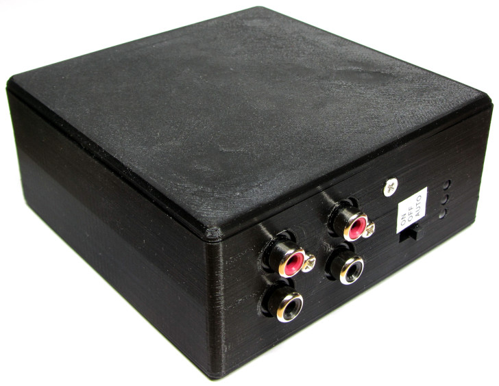
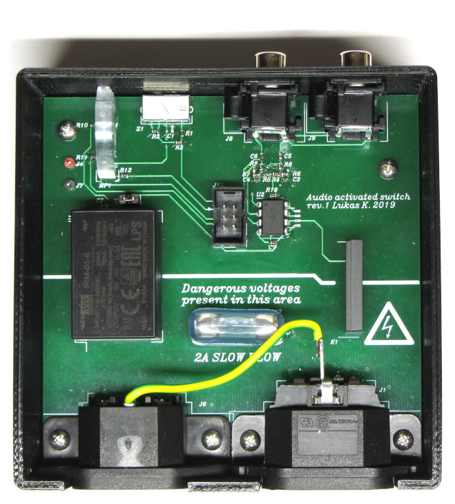
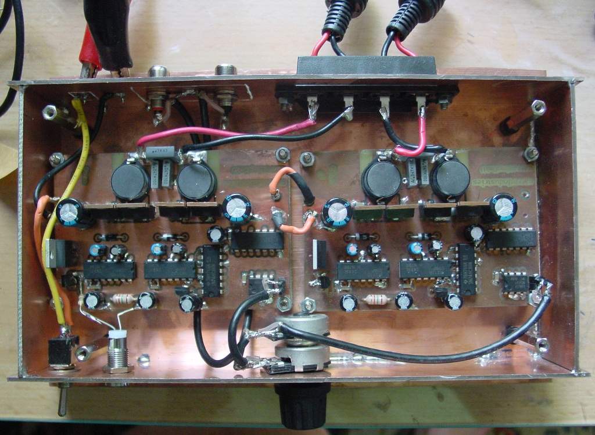

The audio activated switch is a device that switches power to an audio 
amplifier based on the presence of a line level audio signal.

[More pictures](photos/)

# Motivation

My audio amplifier from the 1980s consumes about 30 W of power no 
matter if there's an input signal or it's just sitting there doing 
nothing. Manually turning it on if needed wouldn't have been practical 
since it's too hard to reach below the desk and I'm lazy.

# Implementation

An MCU (ATtiny 85) listens to the line level audio signal using it's 
builtin ADC and turns on a solid-state relay if the peak-to-peak 
detector implemented in firmware reports signal presence for a 
certain time (less than one second). The relay is turned off after 
about 5 minutes of uninterrupted silence.

# Construction

Apart from achieving the desired (pretty trivial) functionality,  this 
project's goal was a to gain experience in the integration of board 
design and mechanical design as it's standard in the industry. One 
aspect of this is eliminating wired connections, so all connectors are 
directly mounted to the board. Indicators use SMD LEDs and light pipes 
instead of flange-mounting regular through hole LEDs.

As we can see from the photo below, that goal has been achieved. The 
case has been 3D printed on a FlashForge Creator Pro using PLA 
filament.

Comparing this to a project of mine from 8 years ago, the progress 
should be pretty clear:

# CAD

Board design has been done in horzion EDA. 

Mechanical design has been done in FreeCAD 0.18. Due to licensing 
restrictions, the vendor-supplied 3D models aren't included. As this is 
one of my first projects involving mechanical CAD, the model isn't as 
robust as it should be.

